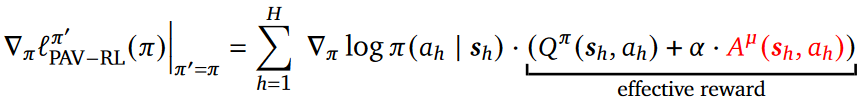

# Toy Problem Setup
## 1. Task

The vocab dictionary is integers ranging from [1, 15]

We are given a specific target sequence of length 5 ranging from [1, 14], such as [12, 3, 5, 8, 4], call it tar_seq.

Now our job is to learn a policy, which can generate a sequence that exactly contains tar_seq. This generated sequence should be terminated whenever seeing a 15 or reaching a max_length of 10.

## 2. Policy Net

This is a 3-layer fully connect neuron network.

## 3. Initialization:

## 4. Policy update

Following this formula

Now for the Q function part, I use the monte-carlo method, having 100 rollouts following the current policy, and calculate mean as the Q value of the current step.

* The trajectory input here, it should follow the current policy? or I can randomly generate any sequence? *

## Some Notes:

For a fixed current policy, I can come up with a matrix that contains all the outcome probabilities of a current input. This matrix is like: {1: [probabilities * 15], 2:[probabilities * 15], ... 15:[probabilities * 15]}. For example, whenever I see 4 as the last token, I can check that matrix to generate next token.
